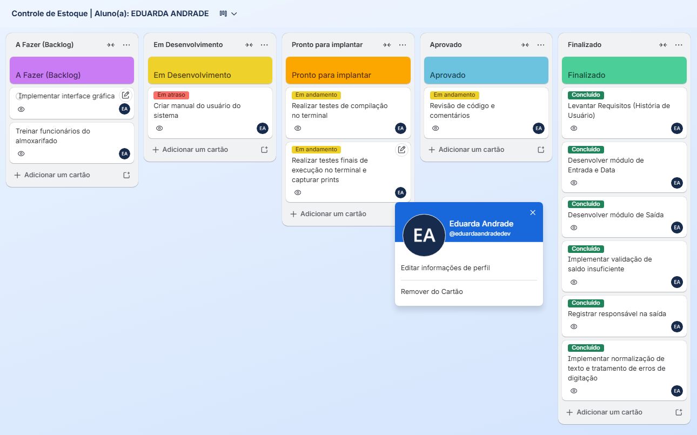
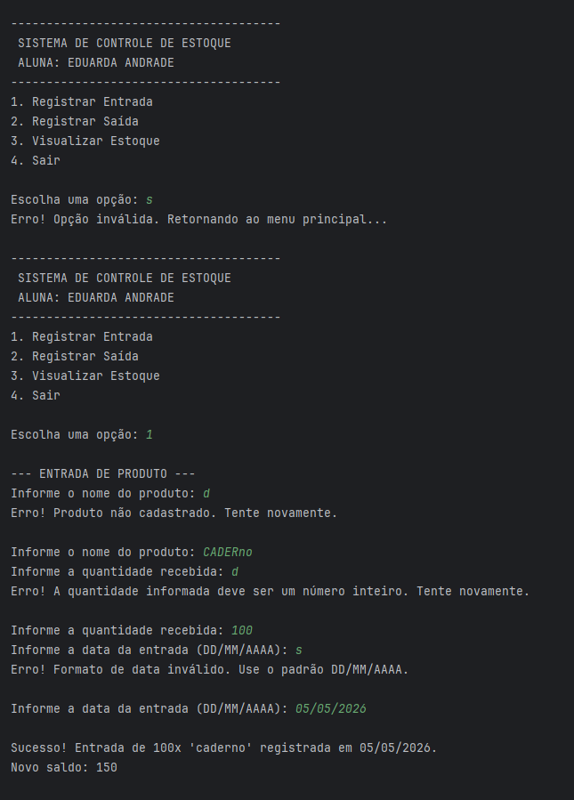
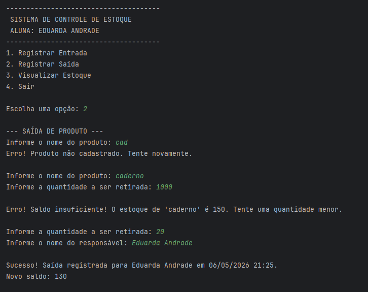
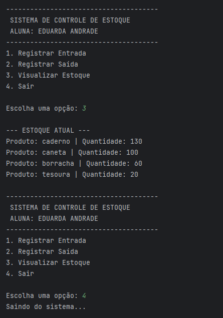

# Sistema de Controle de Estoque | Inventory Control System

Desenvolvimento de uma aplicação para gestão de almoxarifado focada em integridade de dados, validação de entradas e aplicação de metodologias ágeis.

*A warehouse management application developed with a focus on data integrity, input validation, and the application of agile methodologies.*

---

## Visão Geral do Projeto / Project Overview

**PT:** Este projeto foi desenvolvido em maio de 2026 como parte da disciplina de Engenharia de Software. O objetivo foi criar um Sistema de Controle de Estoque em Python que gerencia a entrada e saída de produtos, garantindo a atualização automática de saldos e a rastreabilidade das movimentações (data e responsável). O projeto abrange desde a definição de Histórias de Usuário e Critérios de Aceitação até a implementação do código com tratamento de erros.

**EN:** This project was developed in May 2026 as part of the Software Engineering course. The goal was to create an Inventory Control System in Python that manages product entry and exit, ensuring automatic balance updates and movement traceability (date and responsible party). The project covers everything from defining User Stories and Acceptance Criteria to code implementation with error handling.

---

## Metodologia e Processo / Methodology and Process

**PT:** O desenvolvimento seguiu princípios de metodologias ágeis, utilizando o método **Scrum** para a gestão do projeto e Histórias de Usuário para o levantamento de requisitos. A organização das tarefas foi realizada através de um quadro Kanban para acompanhar o ciclo de vida do desenvolvimento (Backlog, To Do, In Progress, Testing e Done), garantindo que os critérios de aceitação fossem atendidos com rigor técnico.

**EN:** The development followed agile methodology principles, using the **Scrum** method for project management and User Stories for requirements gathering. Task organization was conducted through a Kanban board to track the development lifecycle (Backlog, To Do, In Progress, Testing, and Done), ensuring that acceptance criteria were met with technical rigor.

### Quadro Kanban / Kanban Board

**PT:** Organização do fluxo de trabalho utilizando o quadro Kanban, desenvolvido através da metodologia ágil Scrum.

**EN:** Workflow organization using the Kanban board, developed through the Scrum agile methodology.



---

## Engenharia de Requisitos / Requirements Engineering

### Requisitos Funcionais (RF) / Functional Requirements (FR)

- RF01 (Seleção de Produto) / (Product Selection):
  - **PT:** O sistema deve permitir a seleção de um produto previamente cadastrado no estoque.
  - **EN:** The system must allow the selection of a previously registered product in the stock.

- RF02 (Dados de Entrada) / (Entry Data):
  - **PT:** O sistema deve permitir que o usuário informe a quantidade recebida e a data para o registro de uma entrada.
  - **EN:** The system must allow the user to input the received quantity and the date for recording an entry.

- RF03 (Atualização de Saldo) / (Balance Update):
  - **PT:** O sistema deve atualizar o saldo do produto no estoque de forma automática após a confirmação de entrada.
  - **EN:** The system must automatically update the product balance in the stock after entry confirmation.

- RF04 (Dados de Saída) / (Exit Data):
  - **PT:** O sistema deve permitir a seleção de um produto e a inserção da quantidade a ser retirada para o registro de uma saída.
  - **EN:** The system must allow the selection of a product and the input of the quantity to be withdrawn for recording an exit.

- RF05 (Validação de Estoque) / (Stock Validation):
  - **PT:** O sistema deve validar se há quantidade suficiente no estoque antes de permitir e confirmar a operação de saída.
  - **EN:** The system must validate if there is sufficient quantity in stock before allowing and confirming the exit operation.

- RF06 (Registro de Responsabilidade) / (Responsibility Record):
  - **PT:** O sistema deve registrar obrigatoriamente a data da movimentação e o nome do responsável ao confirmar uma saída.
  - **EN:** The system must mandatorily record the movement date and the responsible person's name when confirming an exit.

### Requisitos Não Funcionais (RNF) / Non-Functional Requirements (NFR)

- RNF01 (Linguagem de Programação) / (Programming Language):
  - **PT:** O sistema deve ser desenvolvido utilizando a linguagem de programação Python.
  - **EN:** The system must be developed using the Python programming language.

- RNF02 (Interface de Mensagens) / (Message Interface):
  - **PT:** O sistema deve apresentar mensagens de erro e sucesso claras para orientar o usuário durante as operações.
  - **EN:** The system must present clear error and success messages to guide the user during operations.

- RNF03 (Desempenho) / (Performance):
  - **PT:** A validação do saldo de estoque deve ocorrer imediatamente, sem causar travamentos no terminal.
  - **EN:** Stock balance validation must occur immediately, without causing terminal freezes.

- RNF04 (Integridade dos Registros) / (Record Integrity):
  - **PT:** Os registros de saída contendo a data e o responsável não devem permitir alteração após serem salvos.
  - **EN:** Exit records containing the date and the responsible person must not allow changes after being saved.

- RNF05 (Qualidade do Código) / (Code Quality):
  - **PT:** O código-fonte deve ser entregue de forma organizada e com comentários explicativos em suas funções.
  - **EN:** The source code must be delivered in an organized manner with explanatory comments in its functions.

- RNF06 (Ambiente de Execução) / (Execution Environment):
  - **PT:** O sistema deve ser capaz de ser executado e compilado via terminal ou console padrão, sem interface gráfica complexa.
  - **EN:** The system must be capable of being executed and compiled via terminal or standard console, without complex graphic interface.

---

## Demonstração e Código / Demo and Code

**PT:** O código foi desenvolvido em Python, utilizando estruturas de dados para o controle de estoque e blocos de decisão para garantir a integridade das operações. Abaixo, um exemplo da lógica de validação de saldo e tratamento de exceções utilizada:

**EN:** The code was developed in Python, using data structures for inventory control and decision blocks to ensure operation integrity. Below is an example of the stock validation and exception handling logic used:

```python
# Exemplo de tratamento de entrada e validação de estoque (Saída)
try:
    quantidade = int(input("Informe a quantidade a ser retirada: "))

    # Só permite a movimentação se houver saldo suficiente
    if quantidade <= estoque[produto]:
        responsavel = input("Informe o nome do responsável: ")
        data_saida = datetime.now().strftime("%d/%m/%Y %H:%M")
        
        # Subtrai a quantidade do estoque
        estoque[produto] = estoque[produto] - quantidade
        
        print(f"\nSucesso! Saída registrada para {responsavel} em {data_saida}.")
        print(f"Novo saldo: {estoque[produto]}")
    else:
      print(f"\nErro! Saldo insuficiente! O estoque de '{produto}' é {estoque[produto]}. Tente uma quantidade menor.\n")
      # Aqui ele voltará para o início do laço para pedir a quantidade novamente
except ValueError:
      print("Erro! A quantidade informada deve ser um número inteiro. Tente novamente.\n")
```
**PT:** [Clique aqui para acessar o código-fonte completo (main.py)](./inventory_management.py)

**EN:** [Click here to access the full source code (main.py)](./inventory_management.py)

---

## Visualização do Sistema / System Visualization

**PT:** Abaixo, capturas de tela do sistema em execução no terminal, demonstrando o fluxo de navegação e as validações rigorosas de regras de negócio:

**EN:** Below, screenshots of the system running in the terminal, demonstrating the navigation flow and strict business rule validations:

### Registro de Entrada e Tratamento de Erros / Entry Registration & Error Handling
**PT:** Demonstração de validação de dados: o sistema recusa entradas inválidas para produtos, quantidades e datas antes de confirmar o registro.
<br>
**EN:** Data validation demonstration: the system rejects invalid inputs for products, quantities, and dates before confirming the entry.




### Registro de Saída e Validação de Saldo / Exit Registration & Balance Validation
**PT:** Validação de regra de negócio impedindo a saída de produtos com saldo insuficiente em estoque.
<br>
**EN:** Business rule validation preventing product exits with insufficient stock balance.




### Visualização de Estoque e Encerramento / Stock Visualization & System Exit
**PT:** Listagem atualizada do estoque e encerramento seguro da aplicação.
<br>
**EN:** Updated stock listing and secure application shutdown.



---

## Decisões de Projeto / Design Decisions

* **Validação Rigorosa / Rigorous Validation**
    * **PT:** Implementação de verificações de tipo e formato de data para prevenir a corrupção do histórico de estoque.
    * **EN:** Implementation of type and date format checks to prevent stock history corruption.

* **Lógica de Saída / Exit Logic**
    * **PT:** O sistema bloqueia movimentações caso o saldo seja insuficiente, garantindo que o inventário nunca apresente valores negativos.
    * **EN:** The system blocks movements if the balance is insufficient, ensuring the inventory never shows negative values.

* **Normalização de Dados / Data Normalization**
    * **PT:** Uso de tratamento de strings para garantir o reconhecimento de produtos independente do uso de letras maiúsculas ou minúsculas.
    * **EN:** Use of string handling to ensure product recognition regardless of uppercase or lowercase usage.

---

## Principais Aprendizados / Key Learnings

* **Alinhamento de Requisitos / Requirements Alignment**
    * **PT:** Uso de Histórias de Usuário e Critérios de Aceitação para garantir que a entrega técnica atenda às necessidades reais de negócio.
    * **EN:** Use of User Stories and Acceptance Criteria to ensure technical delivery meets real business needs.

* **Robustez do Software / Software Robustness**
    * **PT:** Desenvolvimento de lógica de tratamento de exceções em Python para aumentar a confiabilidade da aplicação via terminal.
    * **EN:** Development of exception handling logic in Python to increase application reliability via terminal.

* **Gestão Ágil / Agile Management**
    * **PT:** Aplicação prática de Scrum e Kanban para organizar o ciclo de vida do desenvolvimento de forma eficiente.
    * **EN:** Practical application of Scrum and Kanban to organize the development lifecycle efficiently.

---
## Contexto Acadêmico / Academic Context

Instituição / Institution: UNINTER (Recife, PE)
<br>
Curso / Course: Engenharia de Software
<br>
Data / Date: Maio de 2026 (May 2026)
<br>
Avaliação / Grade: 100/100 (Nota máxima baseada em rigor lógico e aplicação de critérios de aceitação / Max grade achieved based on logical rigor and application of acceptance criteria)
